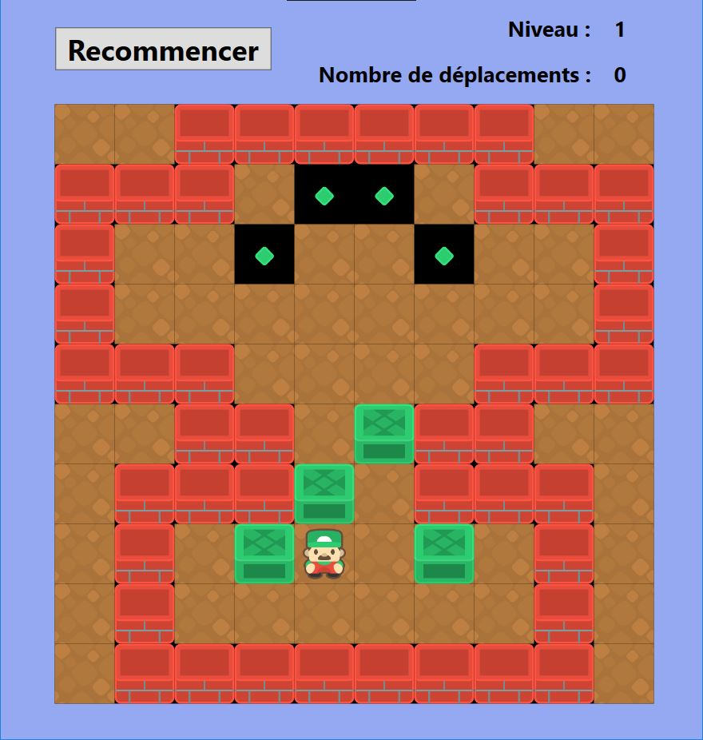

# SobokanGame
Classic Sobokan Game developed using .NET WPF, following the C# fundamentals video tutorial from Elephorm.

## Initial game's features
==> main functions (moves management, counter of moves, restart button)
##
==> design (using sprites form https://www.kenney.nl/assets/sokoban)
##

## Game's improvements
##
==> levels management + display of level number
##
==> use of some characters' sprites depending on the direction of the move
##

## Potential additional improvements
==> 2 players function
##
==> add new levels
##
==> best scores save
##

## Demo

